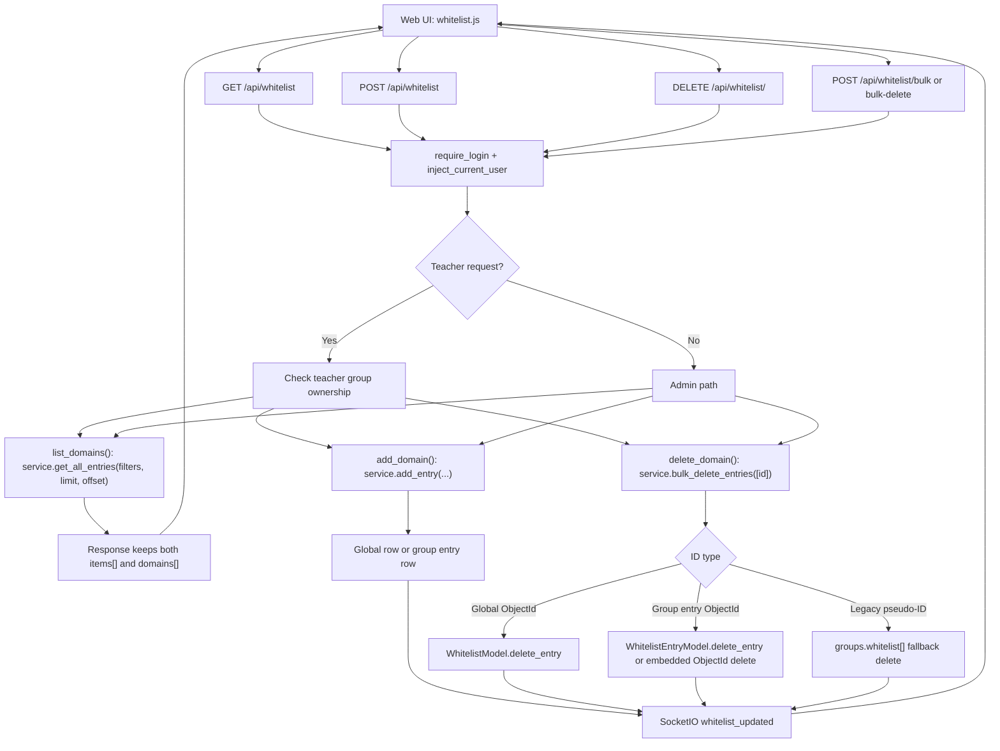
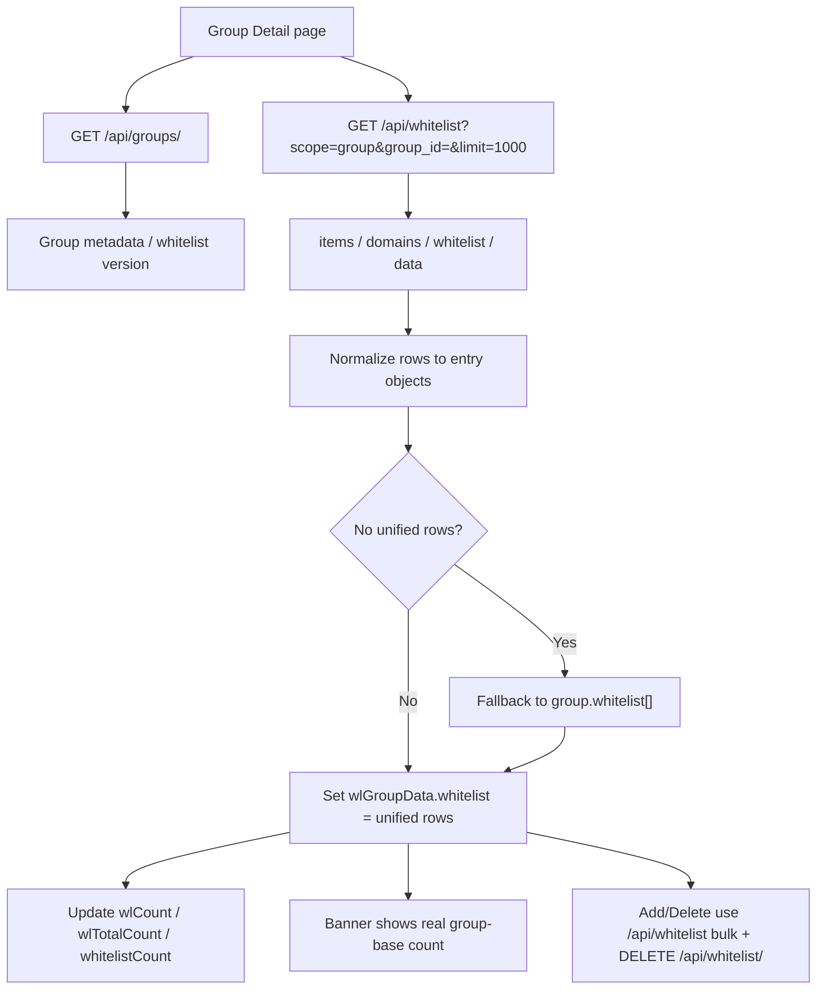
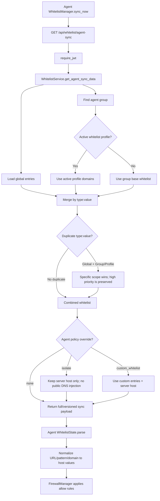
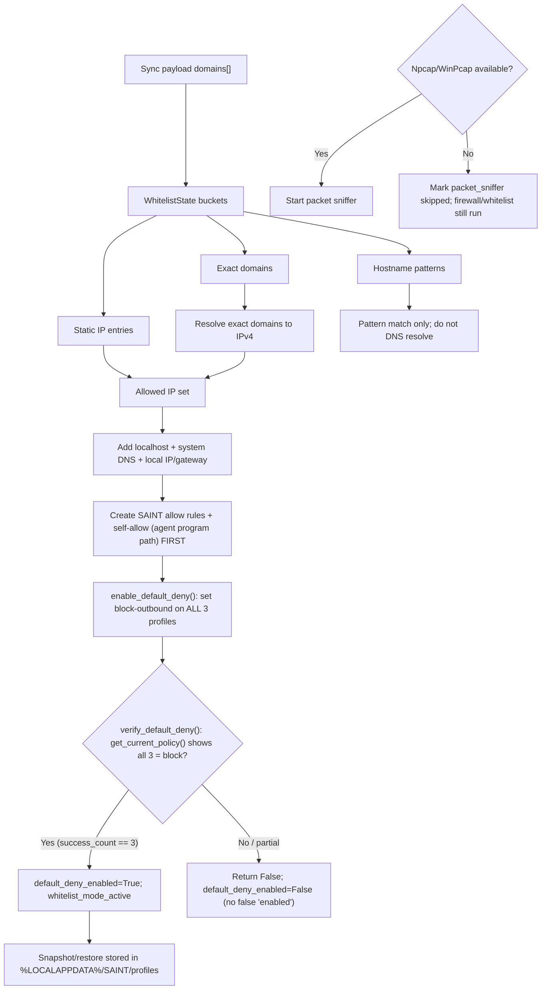
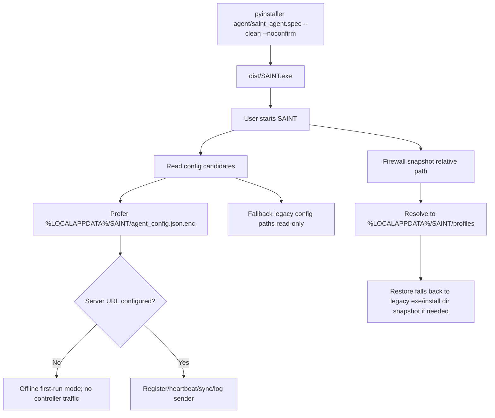
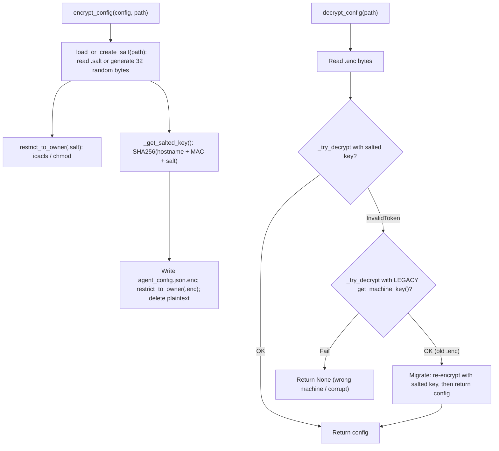
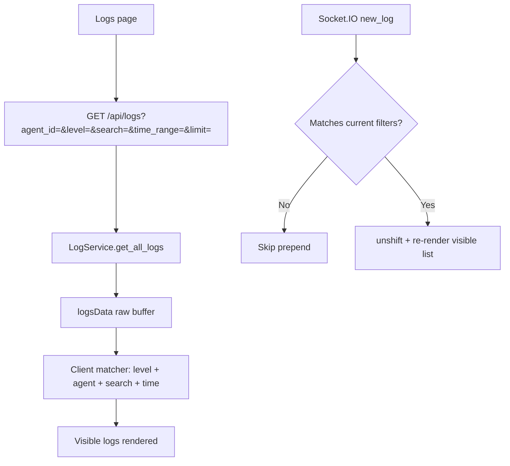

# SAINT Current Runtime Flows

Last checked against source: 2026-06-09.

This page is the current source-readable flow reference for the recent Agent,
Server, whitelist, packaging, and config changes. It intentionally uses
Mermaid diagrams so the flow can be reviewed without opening DrawIO.

## Source Anchors

| Area | Current source of truth |
| --- | --- |
| Web whitelist routes | `server/controllers/whitelist_controller.py` |
| Unified whitelist service | `server/services/whitelist_service.py` |
| Group/profile whitelist | `server/services/whitelist_profile_service.py`, `server/models/group_model.py` |
| Group Detail whitelist editor | `server/views/static/js/group_detail.js` |
| Logs page filters/realtime | `server/views/static/js/logs.js`, `server/services/log_service.py` |
| Agent whitelist sync | `agent/whitelist/manager.py`, `agent/whitelist/state.py` |
| Firewall allow rules | `agent/firewall/manager.py`, `agent/firewall/utils.py` |
| Server URL/config paths | `agent/shared/server_urls.py`, `agent/config/paths.py` |
| Config encryption | `agent/config/crypto.py` (Fernet + per-install salt) |
| Firewall default-deny policy | `agent/firewall/policy.py` (`enable_default_deny`, `verify_default_deny`) |
| Build artifact | `agent/saint_agent.spec` -> `dist/SAINT.exe` |

## Whitelist Web CRUD Flow

`/api/whitelist` remains a compatibility route because the current web UI still
calls it. Internally, list/delete now use the unified entry API.

## Group Detail Inline Whitelist Flow

The Group Detail page no longer trusts `group.whitelist[]` for the visible
count. It resolves the group rows from the unified management API so the
banner and inline editor match the Whitelist page.

## Agent Whitelist Sync And Merge Flow

The server always starts from global entries, then chooses either an active
profile or the group base whitelist. An active profile replaces the group base,
but global entries still remain.

### Merge Rules

| Situation | Result |
| --- | --- |
| No active profile | `Global + Group base whitelist` |
| Active profile exists | `Global + Active profile whitelist`; group base is replaced |
| Same `type:value` in global and group/profile | More specific group/profile entry wins |
| `type=url` full URL | Canonicalized to hostname before store/sync |
| Wildcard URL host | Stored/synced as hostname pattern such as `*.example.com` |

## Agent Apply Firewall Flow

Agent firewall rules are IP based, so only exact domains are DNS-resolved.
Hostname patterns are used for matching state, not DNS resolution.

Default-deny is fail-closed on the "enabled" claim: allow rules and the
agent self-allow rule are created *before* the policy flip, and the manager
only marks `whitelist_mode_active` when all three profiles verify as blocking.

## Config And Packaging Flow

## Config Encryption / Decryption Flow

`agent_config.json` holds the API key and JWT, so it is stored encrypted with
Fernet. The key is derived from machine identity **plus a per-install random
salt** (`secrets.token_bytes(32)`) kept in an ACL-restricted `.salt` file, so
the key can no longer be reproduced from public host identifiers (hostname +
MAC) alone. Configs written by the old machine-only key are migrated forward on
read.

Limitation: a local admin who can read both the `.enc` and the `.salt` file can
still decrypt — inherent to local symmetric encryption without TPM/DPAPI. The
salt defends against ciphertext-only exposure (backup, AV quarantine, a leaked
`.enc`).

## Current Warning Baseline

After the whitelist legacy service cleanup, full tests no longer emit
`get_all_domains` or `delete_domain` deprecation warnings. Remaining warnings
are JWT HMAC key length warnings from local test secrets shorter than 32 bytes.

## Logs Filter And Realtime Flow

The Logs page uses server-side filtering for the initial fetch, but the realtime
Socket.IO stream must also respect the active client filter. This matters for
demo clones where hostname/display name can diverge from the same agent ID.

Client filter rules:

- If selected agent and log both expose hostname/display name, compare the
  visible name first.
- If name is missing, fall back to `agent_id`.
- Search runs against domain, destination, IPs, protocol, agent labels and
  reconstructed detail text.
- `logCount` reflects the rendered subset, not the raw buffer.
