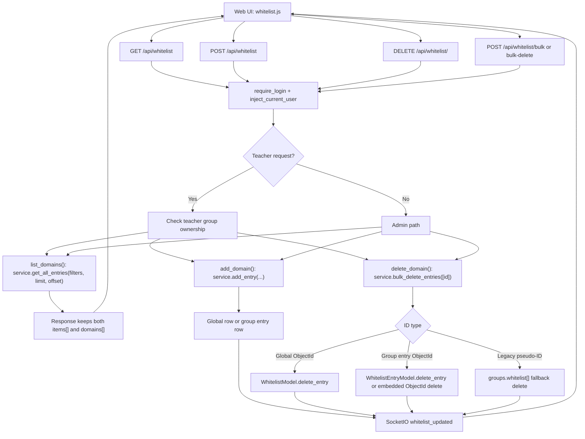
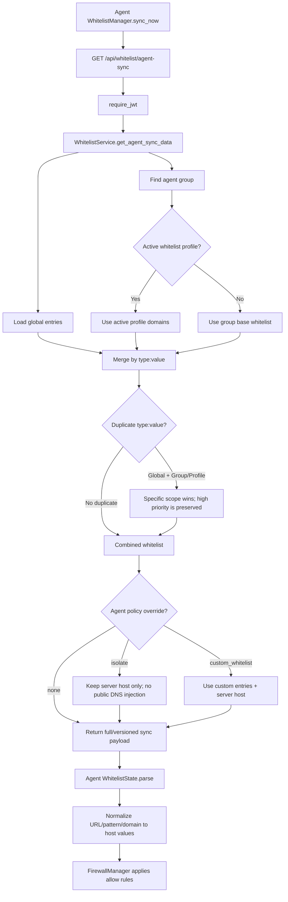
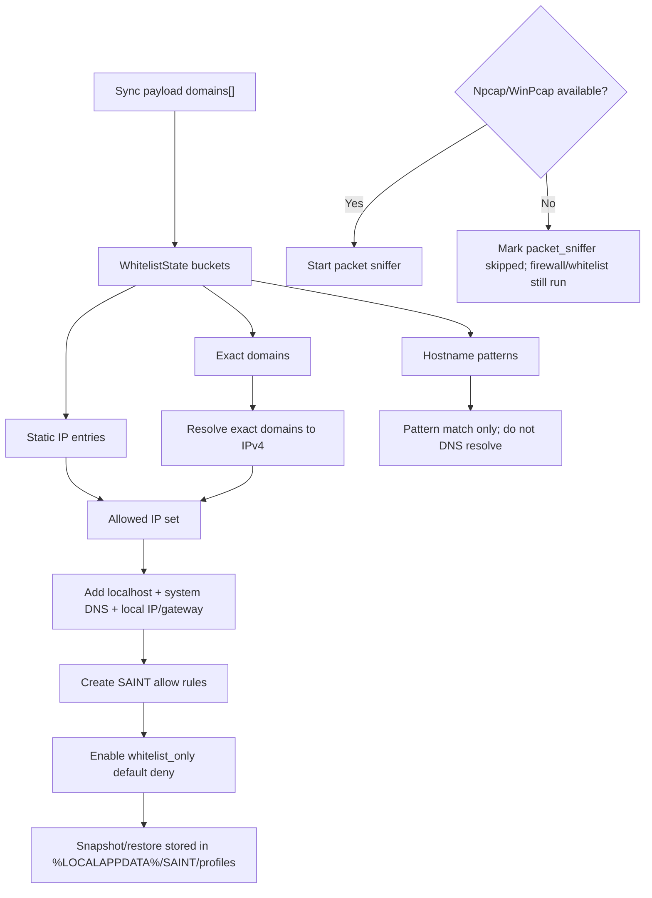
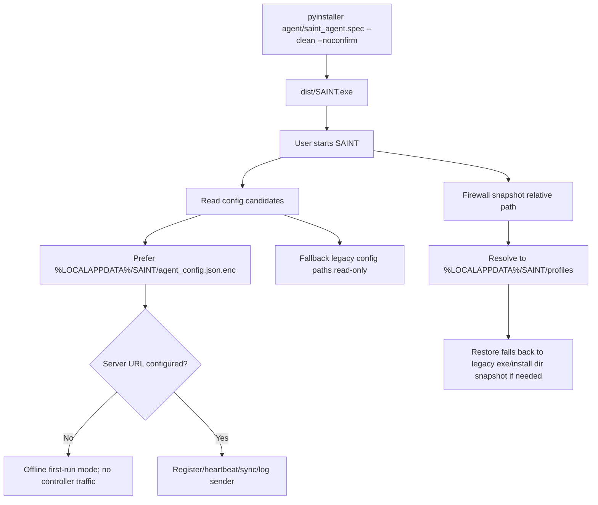

# SAINT Current Runtime Flows

Last checked against source: 2026-06-05.

This page is the current source-readable flow reference for the recent Agent,
Server, whitelist, packaging, and config changes. It intentionally uses
Mermaid diagrams so the flow can be reviewed without opening DrawIO.

## Source Anchors

| Area | Current source of truth |
| --- | --- |
| Web whitelist routes | `server/controllers/whitelist_controller.py` |
| Unified whitelist service | `server/services/whitelist_service.py` |
| Group/profile whitelist | `server/services/whitelist_profile_service.py`, `server/models/group_model.py` |
| Agent whitelist sync | `agent/whitelist/manager.py`, `agent/whitelist/state.py` |
| Firewall allow rules | `agent/firewall/manager.py`, `agent/firewall/utils.py` |
| Server URL/config paths | `agent/shared/server_urls.py`, `agent/config/paths.py` |
| Build artifact | `agent/saint_agent.spec` -> `dist/SAINT.exe` |

## Whitelist Web CRUD Flow

`/api/whitelist` remains a compatibility route because the current web UI still
calls it. Internally, list/delete now use the unified entry API.

## Agent Whitelist Sync And Merge Flow

The server always starts from global entries, then chooses either an active
profile or the group base whitelist. An active profile replaces the group base,
but global entries still remain.

### Merge Rules

| Situation | Result |
| --- | --- |
| No active profile | `Global + Group base whitelist` |
| Active profile exists | `Global + Active profile whitelist`; group base is replaced |
| Same `type:value` in global and group/profile | More specific group/profile entry wins |
| `type=url` full URL | Canonicalized to hostname before store/sync |
| Wildcard URL host | Stored/synced as hostname pattern such as `*.example.com` |

## Agent Apply Firewall Flow

Agent firewall rules are IP based, so only exact domains are DNS-resolved.
Hostname patterns are used for matching state, not DNS resolution.

## Config And Packaging Flow

## Current Warning Baseline

After the whitelist legacy service cleanup, full tests no longer emit
`get_all_domains` or `delete_domain` deprecation warnings. Remaining warnings
are JWT HMAC key length warnings from local test secrets shorter than 32 bytes.
