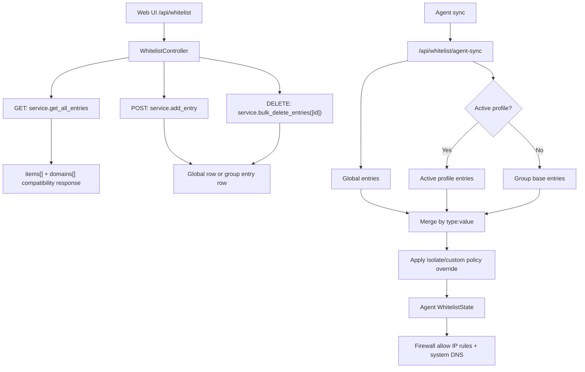

# Current Code Documentation And Flow Audit - 2026-06-05

## Summary

Đã đối chiếu các thay đổi mới nhất của code với `docs/`, `docs/reference/`,
`docs/flow-diagrams/`, và `report/`.

Các điểm đã cập nhật:

- Whitelist service đã xóa `get_all_domains()` và `delete_domain()`.
- Web route `/api/whitelist` vẫn giữ để tương thích UI, nhưng list/delete đã
  đi qua unified entry API.
- Whitelist sync hiện là:
  - không có active profile: `Global + Group base whitelist`;
  - có active profile: `Global + Active profile whitelist`;
  - duplicate `type:value`: group/profile thắng global.
- Server policy không inject public DNS; agent tự thêm system DNS tại máy.
- Config/snapshot mutable state dùng `%LOCALAPPDATA%\SAINT`.
- Build artifact chính là onefile `dist/SAINT.exe`.
- Logs agent filter hien thi hostname hien tai theo `agent_id`; van giu
  `logged_agent_host` de truy vet hostname cu trong log.

## Updated References

| File | Nội dung cập nhật |
| --- | --- |
| `docs/reference/current-flows.md` | Flow Mermaid chuẩn cho whitelist CRUD, sync/merge, agent firewall apply, config/build |
| `docs/reference/server/services.md` | Whitelist service chuyển sang `get_all_entries`, `delete_entry`, `bulk_delete_entries` |
| `docs/reference/server/controllers.md` | `/api/whitelist` là compatibility route, internally dùng unified entry API |
| `docs/flow-diagrams/17-whitelist-crud-flow.drawio` | Delete flow đổi từ `service.delete_domain(id)` sang `service.bulk_delete_entries([id])` |
| `docs/SERVER_DOCUMENTATION.md` | Ví dụ IP whitelist không dùng public DNS IP |
| `report/ARCHITECTURE_REVIEW_AND_CLEANUP_PLAN.md` | Legacy whitelist domain API status cập nhật theo code mới |
| `report/server/05_TONG_HOP_HAM_VA_CONG_DUNG_SERVER.md` | Bảng hàm WhitelistController/WhitelistService sửa khỏi method đã xóa |
| `report/agent/08_CAP_NHAT_2026_06_04_AGENT_BUILD_GUI_FIREWALL_URL.md` | Them section Logs agent filter hostname display fix |
| `server/services/log_service.py`, `server/views/static/js/logs.js` | Logs filter enrich hostname hien tai va giu hostname cu trong detail |

## Flow Snapshot



## Verification

Đã chạy sau thay đổi whitelist flow:

```text
server/tests/test_whitelist_and_logs.py: 127 passed
targeted whitelist flow suite: 170 passed
compileall agent/server/tools: pass
git diff --check: pass (chỉ LF/CRLF warnings trên Windows)
```

Remaining warning baseline:

- Không còn deprecation warnings từ `get_all_domains`/`delete_domain`.
- Full test baseline còn JWT HMAC key length warnings nếu `.env` local dùng
  secret ngắn hơn 32 bytes.

Logs filter verification:

```text
server/tests/test_whitelist_and_logs.py::TestLogService: 18 passed
node --check server/views/static/js/logs.js: pass
```
