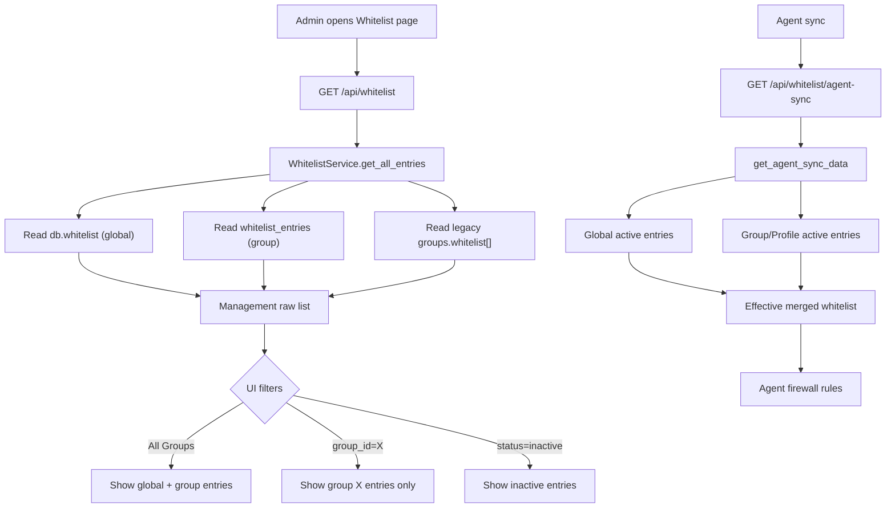

# Cap nhat 2026-06-05 - Whitelist Group Filter va Status

## Muc tieu

Sua loi trang Whitelist cua admin:

- `All Groups` phai hien global entries va group entries.
- Filter theo mot group chi hien entries cua group do, khong kem global.
- `Active` / `Inactive` phai co tac dung that, inactive khong duoc sync xuong agent.
- Teacher khong sua group whitelist nua; teacher dung Whitelist Profile.

## Ket qua da sua

### 1. Tach management list va effective whitelist

`GET /api/whitelist` bay gio la management list raw cho UI quan tri. Endpoint nay doc entry dung theo noi luu that:

- Global entries tu `db.whitelist`.
- Group entries moi tu `db.whitelist_entries`.
- Legacy group entries tu `groups.whitelist[]`.

Effective merge `global + group/profile` van giu cho agent sync va view explicit:

- `/api/whitelist/agent-sync`
- `/api/whitelist?agent_id=...`
- `/api/whitelist?effective=1&group_id=...`

References:

- `server/controllers/whitelist_controller.py`: `list_domains()` chi goi `get_scoped_whitelist()` khi co `agent_id` hoac `effective=1`.
- `server/services/whitelist_service.py`: `get_all_entries()`, `_collect_management_entries()`, `_filter_management_entries()`.

### 2. Sua filter group/status

Rule hien tai:

- Khong co `group_id`: hien entries theo filter type/status/search, bao gom global + group.
- Co `group_id=X`: chi hien `scope=group` va `group_id=X`.
- `status=active`: chi hien active.
- `status=inactive`: chi hien inactive.
- `status=all` hoac bo trong: hien ca active va inactive.

References:

- `server/services/whitelist_service.py`: `_filter_management_entries()`.
- `server/views/static/js/whitelist.js`: `loadItems()` gui `search`, `type`, `status`, `group_id` len server thay vi chi filter DOM client-side.

### 3. Status co tac dung that

Truoc do UI co checkbox/status nhung service hardcode `is_active=True` khi add single/bulk. Da sua de:

- `active` va `is_active` tu form/API duoc luu dung.
- String nhu `"false"` khong bi Python coi la truthy.
- Inactive global/group entries van hien trong management UI khi filter phu hop.
- Inactive entries bi loai khoi agent sync.
- Toggle status qua `/api/whitelist/bulk-update` bump version dung qua model/service update path.

References:

- `server/models/whitelist_model.py`: `_coerce_active()`, insert/update/bulk insert.
- `server/models/whitelist_entry_model.py`: `_coerce_active()`, `list_entries()`, update theo `matched_count`.
- `server/services/whitelist_service.py`: add single, bulk add, normalize legacy group rows.
- `server/views/static/js/whitelist.js`: `setItemsActive()`, `bulkSetItemsActive()`.
- `server/views/templates/whitelist.html`: bulk `Activate` / `Deactivate` buttons.

### 4. Group whitelist write path dung unified entry API

Frontend khong con sua group whitelist bang:

```text
PATCH /api/groups/<group_id>
{ "whitelist": [...] }
```

Thay vao do, group whitelist add/delete/status dung unified entry API:

- Add: `POST /api/whitelist` voi `scope=group`, `group_id`.
- Delete: `DELETE /api/whitelist/<entry_id>`.
- Activate/Deactivate: `POST /api/whitelist/bulk-update`.

References:

- `server/views/static/js/whitelist.js`: `addItemToGroup()`, `removeItem()`, `setItemsActive()`.
- `server/controllers/whitelist_controller.py`: `add_domain()`, `delete_domain()`, `bulk_update_entries()`.

### 5. RBAC moi cho teacher/admin

Quyet dinh moi:

- Teacher chi `whitelist:read`.
- Teacher duoc dung `whitelist_profile:create/update/delete/activate`.
- Teacher khong duoc create/update/delete/import/bulk whitelist entries, ke ca own group.
- Group lifecycle/update/delete la admin-only.
- Admin giu full group/whitelist management permissions.

References:

- `server/config/rbac_config.py`: teacher whitelist read-only, admin extra co full whitelist/group permissions.
- `server/controllers/whitelist_controller.py`: teacher write endpoints tra `403`.
- `server/controllers/group_controller.py`: `PATCH/DELETE /api/groups/<id>` admin-only.
- `server/views/static/js/auth.js`: client-side teacher permissions dong bo lai.

## Flow sau khi sua



## Test da chay

```powershell
python -m compileall -q agent server tools
python -m pytest server/tests/test_whitelist_and_logs.py -q --tb=short
python -m pytest server/tests/test_teacher_data_filtering.py -q --tb=short
python -m pytest server/tests/test_groups.py -q --tb=short
python -m pytest server/tests -q --tb=short
git diff --check
```

Ket qua:

- `server/tests/test_whitelist_and_logs.py`: 131 passed.
- `server/tests/test_teacher_data_filtering.py`: 78 passed.
- `server/tests/test_groups.py`: 73 passed.
- Full `server/tests`: 547 passed, 22 warnings.
- `git diff --check`: pass, chi co warning LF/CRLF tren Windows.

## Warning con lai

22 warnings con lai den tu test JWT secret ngan hon 32 bytes trong `server/tests/test_users_auth.py`. Day la warning test-secret, khong phai regression cua whitelist/group/status.

