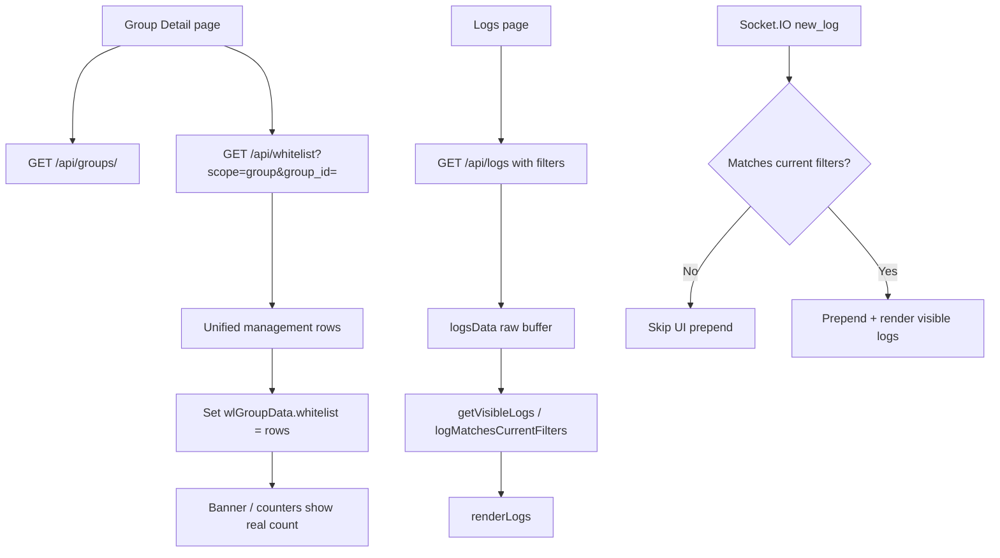

# Cap nhat 2026-06-08 - Group Detail Whitelist Count va Logs Agent Filter

## Muc tieu

Sua 2 loi UI phat hien trong setup demo lab:

- Group Detail cua `Phong 1` co 60 domain trong group whitelist nhung banner
  `Using Group Base Whitelist` van hien `0 domains`.
- Trang Logs dang chon agent `PC1` nhung log realtime moi cua agent/hostname
  khac van chen vao danh sach.

## 1. Group Detail doc sai nguon whitelist

### Hien tuong

Trang Whitelist dung du lieu unified management API nen thay 60 entries. Rieng
Group Detail inline whitelist editor va banner lai doc `group.whitelist[]` tu
`GET /api/groups/<group_id>`.

Sau migration group whitelist sang `whitelist_entries`, field embedded
`group.whitelist[]` co the rong trong khi du lieu that nam o:

- `db.whitelist_entries` cho group entries moi.
- `groups.whitelist[]` chi con legacy fallback.

Vi vay banner lay:

```js
(wlGroupData.whitelist || []).length
```

nen hien `0 domains`.

### Ket qua sua

`server/views/static/js/group_detail.js` da doi inline whitelist editor sang
unified whitelist API:

- Load song song:
  - `GET /api/groups/<group_id>` de lay metadata/version.
  - `GET /api/whitelist?scope=group&group_id=<group_id>&limit=1000` de lay
    entries that.
- Normalize nhieu shape response: `items`, `domains`, `whitelist`, `data`.
- Fallback `group.whitelist[]` neu API moi chua co row.
- Set lai `wlGroupData.whitelist = groupEntries`, sau do update:
  - inline list count,
  - total count,
  - hero count,
  - banner `Using Group Base Whitelist (N domains)`.
- Add group entry bang `POST /api/whitelist/bulk`.
- Delete group entry bang `DELETE /api/whitelist/<entry_id>`.
- Pseudo-ID fallback dung format backend chuan:
  `group::<group_id>::<type>::<value>`.
- Escape HTML cho type/category/data attributes trong list render.

### File chinh

- `server/views/static/js/group_detail.js`
- `server/services/whitelist_service.py`
- `server/controllers/whitelist_controller.py`
- `docs/reference/server/whitelist_entries.md`

## 2. Logs filter bi realtime event bypass

### Hien tuong

`loadLogs()` co gui filter server-side:

```text
GET /api/logs?agent_id=<selected_agent_id>&...
```

Nhung Socket.IO event `new_log` trong `logs.js` lai lam:

```js
logsData.unshift(logData)
renderLogs(logsData)
```

Khong check active filter. Vi vay khi dang chon `PC1`, log moi cua `sirnbx`
van duoc chen vao UI.

### Ket qua sua

`server/views/static/js/logs.js` co helper filter dung chung:

- `logMatchesCurrentFilters(log)`
- `logMatchesSelectedAgent(log)`
- `getVisibleLogs(logsData)`
- `updateDisplayedLogCount(...)`

Quy tac agent filter moi:

- Neu selected agent va log deu co hostname/display name, so theo name truoc.
  Day xu ly demo clone bi trung `agent_id`: chon `PC1` thi log hostname
  `sirnbx` bi loai.
- Neu thieu hostname thi fallback sang `agent_id`.
- Search, level, time va agent dung chung matcher.
- Socket `new_log` chi prepend neu `logMatchesCurrentFilters(logData)` true.
- Counter `N displayed` tinh theo list that dang render, khong theo raw buffer.

### File chinh

- `server/views/static/js/logs.js`
- `server/services/log_service.py`
- `server/controllers/log_controller.py`

## Flow moi



## Verification

Da chay trong phien sua:

```powershell
node --check server/views/static/js/group_detail.js
node --check server/views/static/js/logs.js
python -m pytest server/tests/test_whitelist_and_logs.py -k "group_bulk_add_writes_to_whitelist_entries_first or delete_entry_accepts_real_embedded_object_id or bulk_delete_group_entries" -q
```

Ket qua:

- `group_detail.js`: syntax pass.
- `logs.js`: syntax pass.
- Targeted group whitelist tests: `3 passed, 128 deselected`.

Ghi chu: full `server/tests/test_whitelist_and_logs.py -q` bi timeout sau hon
2 phut trong phien nay, nen verification chinh la syntax + targeted regression
cho group whitelist add/delete.

